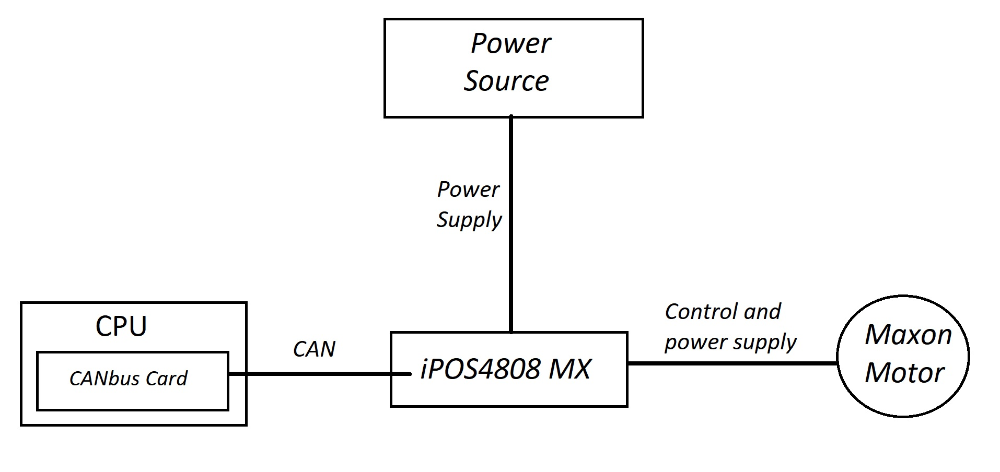

Hardware
========

Drive IPOS4808 MX
------------------
The drive [iPOS4808](http://www.technosoftmotion.com/en/intelligent-drives-and-motors/other-drives/plug-in/ipos4808-mx) oversees the performing of the control task in the movement of the motors. The device is characterized by its completely digital intelligent servomechanism [^1] (servo), based in the latest DSP2 technology [^2] which offers high efficiency, combined with an integrated motion controller.

This kind of drive can perform a position, velocity or torque control in individual, multi-axis or independent configuration. The aforesaid movement controller allows the device to combine the controller, the drive and the PLC [^4] functionality in a single compact unit, being also capable of complex movements without the need of an external motion controller. The high level Technosoft's Motion Programming Language (TML) permits that the following operations could be executed directly in the drive level: Adjustment of various motion modes, changing those modes and their parameters, flux control of the program through interruptions and conditional calls, management of the input/output signals, performance of data transfer, etc.

All iPOS4808 are equipped with an RS232 series interface [^5] and a CAN 2.0B interface [^6] that can be configured with the hardware to operate in two different modes:
*When CANOpen mode is selected, the iPOS4808 is controlled with a CANOpen Master. This iPOS also offers the master the possibility of calling motion sequences written in TML and store in the EEPROM unit [^7], using the supplier specific objects.
*When the TMLCAN [^8] mode is selected, the iPOS4808 acts as an intelligent Technosoft standard unit and complies with the Technosoft protocol to exchange TML commands through the CANBUS.
*When a higher-level coordination is needed, the units Ipos4808 can be controlled with a CANOpen master but also with a PC or PLC using a TML_LIB motion library. 

Computer equipped with CANBus
-----------------------------
The computer is connected to the iPOS device through CANBus, using a communication interface between the aforesaid computer and drive, being consequently a CANBus based protocol. The fractional control is designed in this computer to communicate with the iPOS, so that the the control of the motor is performed through the device. 

Maxon Motor
------------
The Maxon Motor is the mechanical actuator in charge for the movement of TEO's articulations. The motor receives the instructions from the iPOS4808 device and transform them into mechanical The iPOS itself does the control action over the motor, as well as it provides it with power supply.

Power Source
------------
Provides power supply to the device iPOS4808, and consequently also to the motor. 

----------------------------------------------------------------------------------------------------------------------------------------

In the following figure, a diagram of the conexions between the different elemenents which compose the system is depicted:

The CANbus card incorporated in the computer is connected to the iPOS4808 device through CAN. Moreover, the device is connected to the motor as a controller and power supplier.  Finally, this power is obtained from the power source that is used to feed the iPOS device.
This system is implemented inside the robot TEO, from the Universidad Carlos III de Madrid and it is employed in the articulations’ motion, which is controlled by the iPOS.

.jpg)

----------------------------------------------------------------------------------------------------------------------------------------

[^1]: Servomechanism: is a servomotor with an ecnoder and an driver inside. This components form a closedloop circuit to control the position, velocity and torque.

[^2]: DSP2 technology: (Digital signal processor 2) is a system based in a procesor or microprocesor that possess a group of instructions, an optimized hardware and software for applications that require numercial operations at very high speed. 
The drive can be implemented to control DC and AC (vector control [^3]) brushless motors, brushed DC motors and stepper motors. Additionally, the drive could be implemented with a power supply with shaft encoders (squared or sin/cos) and Hall linear signals.

[^3]: Vector control: strategy that uses a variable-frequency inverter control method where two ortogonal compoenents (motor magnetic flux and torque), that can be visualized with a vector, represent the stator currents of a three-phase AC electric motor.

[^4]: PLC (Programmable Logic Controller): a computer device used to automate electromechanic process. 

[^5]: RS232 series: and interface that designates a standard for the exchange of serial binary data beetween a DTE (Data Termianl Equipment) and DCE (Data Communication Equipment. For example: a computer (DTE) and a modem (DCE).

[^6]: CAN2.0B: The last extended version of the CAN specifications. CAN (Controller Area Network) is a communication protocol based in bus topology for the transmission of messages in distributed environments. 

[^7]: EEPROM unit: a deivce with a card shape whcihc purpose is to store big amounts of data in small physical space. It allows reading and writing in multiple memory positions. 

[^8]: TMLCAN: a protocol based on CAN2.0B which includes TLM instructions.

