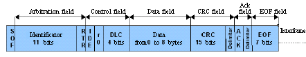
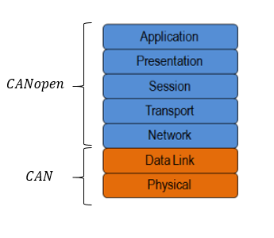
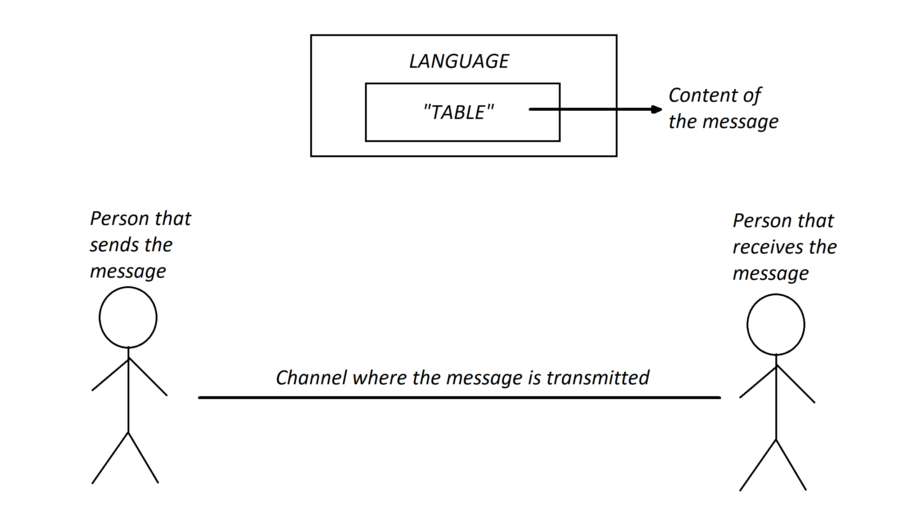

INTRODUCTION
============

DESIGN OF THE CONTROL LIBRARIES
------------------------------
A control library is necessary for the communications between the computer equipped with a CANbus card and iPOS408X device. This library allows the construction of a fractional-order control system (FOC)[^1] or an advanced control system (ACS)[^2], as well as introducing this type of control in robotic applications, specifically in the robot TEO available in the University Carlos III of Madrid. For the construction of the Soft Link Neck from the project HUMAsoft it is of great importance the developement of this library.

The following information is related to the concepts introduced above:

**CANbus**

CAN (Controller Area Network) was developed by Bosch in 1985 for the vehicles network. Before the design of the protocol CAN, the suppliers of automobiles connected the electronic devices in the vehicles using point-to-point cabling systems. When replacing the cabling with communication networks in the vehicles, the cables’ cost was considerably reduced, as well as their complexity and weight. The automobile industry adopted rapidly CAN and, in 1993, it became the international standard, known as ISO 11898. Since 1994, many high-level protocols have been standardized from CAN, for example CANopen and DeviceNet, and its use has extended to other industries, away from the automobile industry. 

The CAN protocol has different physical layers that can be used. In these physical layers, certain aspects of the network are classified, for instance the electric levels, the signals diagrams, the cables impedance, the maximum transmission rate, etc. The physical layers more common and widely employed are the following:
 
  * **High Speed CAN:** is the most common physical layer. These types of CAN networks are implemented with two cables, and allow     communications with a transference rate up to 1 Mb/s. The typical devices inside this layer are, for example, anti-blockage system (ABS) brakes, motor’s control modules, or emissions systems.  
  
  * **Low Speed CAN Hardware:** these networks are also implemented with two cables. The devices can communicate at a rate of 125 kb/s, and have transceivers with of error tolerance capacities. Some examples of typical devices in automobiles that include this layer are the comfort devices or the brakes’ lights.
  
  * **CAN Hardware selection by software:** the CAN interfaces can be configurated through the software, and consequently, they can use any of the included transceivers.

**CANbus: data structure**

CAN devices, send data through the CANbus network in packages with a determined structure. These packages are formed by the following parts, as it can be observed in the figure.

  * **SOF:** the bit that determines the start of the message.
  * **Arbitration field:** identifies the message and indicates its priority. This part can be standard (with 11 bits) or extended (with 29 bits).
  * **RTR:** it can differentiate a remote frame from a data frame. A 0 RTR bit indicates a remote frame, while 
  * **IDE:** allows the differentiation between an standard or extended Arbitation Field.
  * **DLC:** indicates the number of data bytes that contains the data field.
  * **Data:** contains between 0 to 8 data bytes that are going to be transmitted.
  * **CRC:** is a 15 bit redundant cyclic revision code, having a recessive bit to delimitate it. This filed is used for error detection. 
  * **ACK:** when a message is correctly received, the device sends an ACK bit at the end of the message. The sensor’s node checks the ACK bit, and if this last is not detected, the data is sent again. 
  * **EOF:** indicates the end of the message.
  
**CANopen**

CANopen is a high-level communication protocol, which is based in the CAN protocol introduced above. The protocol was developed, principally, for network applications integrated in vehicles. CANopen covers different fields including network programming, device description, interface definition or application profiles. Moreover, it provides a protocol that normalizes the communication between devices and applications from different suppliers. It is used in a wide range of industries, although it stands out in automatization applications.

There are different levels inside these protocols, as it can be observed in the following picture. CAN covers the first two levels, which are the physical layer (it defines the lines used, the stresses, the nature of the high speed, etc.) and the data link layer. CANopen, on the other hand, cover five principal layers, which are the following: network layer (addressing and routing), transport layer (reliability end to end), session layer, data presentation layer (structure of the data) an teh application layer (describes how to configure, transfer and synchronise the CANopen devices).

**CANopen: data structure**

The format of the messages for a CANopen frame, is based in the format of the frame in CAN. In the CAN protocol, the data is transferred in frames that consist in a CAN-ID of 11 or 29 bits (standard or extended), control bits as the RTR, a starter bit and an “end of message” bit, a length of the message field, and the data (from 0 to 8 bytes). In CANopen, the ID is referred as COB-ID, and consist in a CAN-ID of 11 bits, divided in two parts: a function code of 4 bits and a Node-ID of 7 bits. The 7 bits size limitation also limits the number of devices that can be used in a CANopen network (concretively, it can only admit the usage of a maximum of 127 nodes). In the following figure it can be observed the structure of the data in the CANopen protocol.

  
In the figure above it can be observed that the structure is quite similar to the one in the CAN protocol, which signifies that it is relatively simple to change between a protocol to another while designing the control library.

**Control library designed**

The library was used for the realization of many communication tests, although it was firstly needed to program a function that converted from CAN to CANopen, along with a function that performs the opposite action.

With the purpose of reaching a better understanding of why is it necessary the design these two functions, a practical example is proposed, which can be observed in the next figure.

As it can be observed in the figure above, there is a person that transmits the message, and another that receives the message. The sender desires to communicate an object (in this case a table). The message "table" is inside of the language label, which signifies that both persons speak the same language.

In the figure, a line links both persons, which represents the channel in which the message is transmitted (in the example, the message is sent by email) being this channel equivalent to CANbus. Before transmitting the message, the sender knows the content the message, as well as the language that is needed (which is equivalent to the CANopen layer), although the message is not sent yet. Once the sender writes the word "table" in the computer and sends it by email and the other person receives it, the environment is the CANbus layer.

Continuing with example, the sender, before sending the word by email, had to translate the word from his mind to the computer (write the words in a proper order, etc.), thus being equivalent to the function designed that converts the CANbus data to CANopen (some CANbus data messages are received and in order to understand them a transformation to CANopen is needed).

Translating this example to a more technical language, the function that transforms the CANopen data to CANbus is used to transmit the message in a proper way. When the iPOS receives the message, it uses the function that converts form CANbus to CANopen to be able to understand the message. In the case that the iPOS device realizes an answer, the opposite process would be performed, and message would travel to the opposite end.

Once both functions are performed, different messages in CANopen were built and snet form the computer to the iPOS device to check the functioning of the communication, as well as to verify that the answer was the expected.

